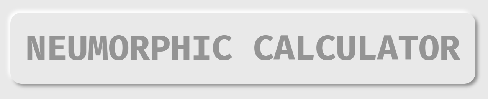
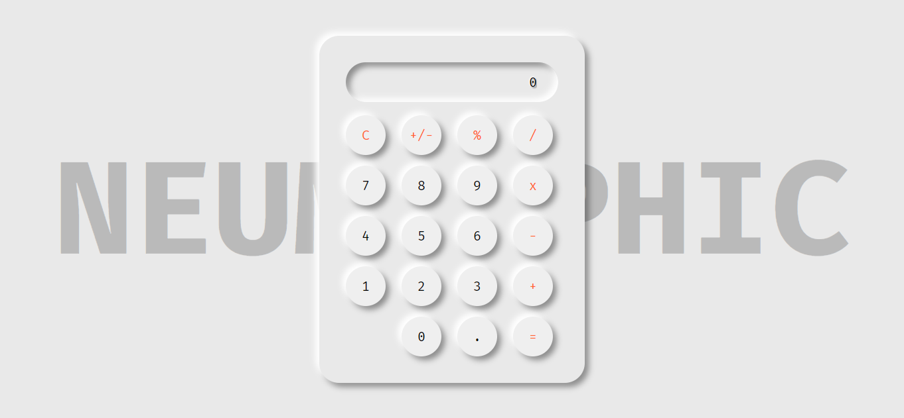

<h1 align="center" >
  
</h1>

  
  
  
  

## 🚀 Technologies  

This project was developed with the following technologies:

- [HTML5](https://html.com/)
- [CSS3](https://html.com/css/)
- [JavaScript](https://www.javascript.com/)

## 🔨 Project

A simple calculator with the neumorphic style of design.

## 🎨 Layout

  

